# User Stories

When you land on the main screen, you will be asked for the following permissions:

- *`READ_CALL_LOG`* to display call log on the main screen;
- *`READ_CONTACTS`* to resolve contact names for the call log entries.

&nbsp;&nbsp;&nbsp;&nbsp;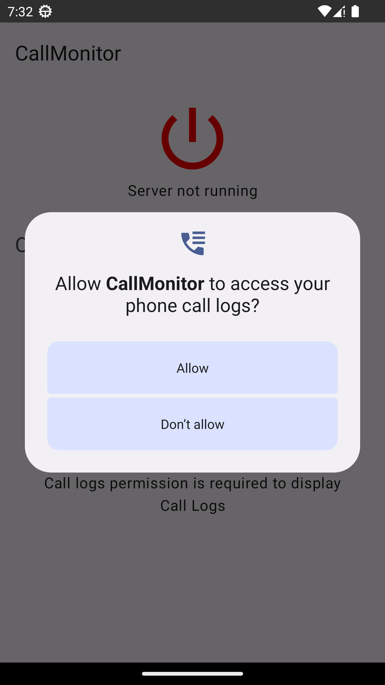
&nbsp;&nbsp;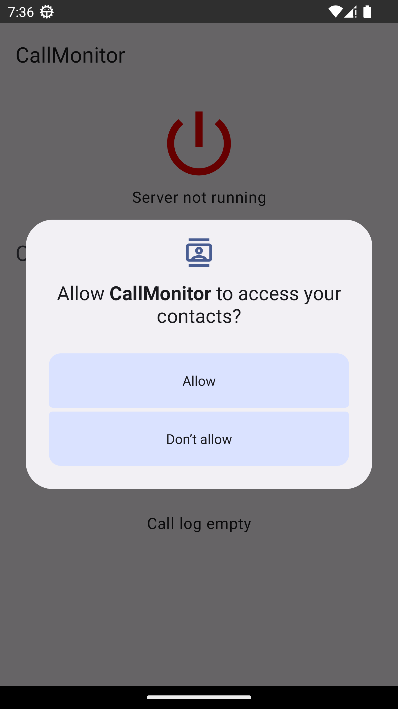

On the main screen, if the contact by a normalized phone number is not found in the contacts or due to a denied permission, a phone number will be displayed instead of the contact name.

Number of results is always limited to 100. Paging is not supported to reduce the scope of the project.

And yes, dark theme is also supported:

&nbsp;&nbsp;&nbsp;&nbsp;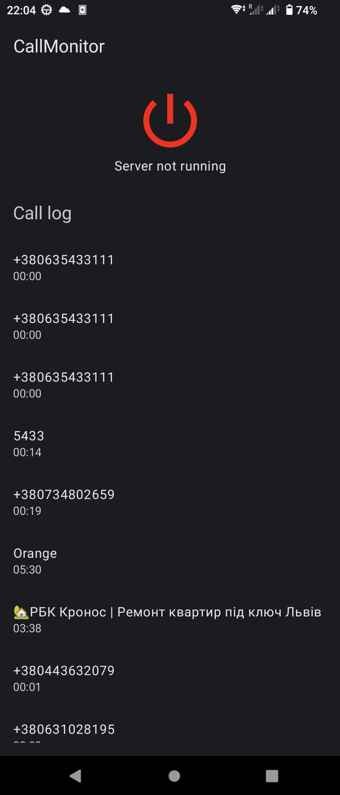

If *`READ_CALL_LOG`* is denied, the rationale will be shown with "Proceed" button to request the permission.

If the rationale should not be shown, the "Proceed" button will lead to *`Settings.ACTION_APPLICATION_DETAILS_SETTINGS`*.

&nbsp;&nbsp;&nbsp;&nbsp;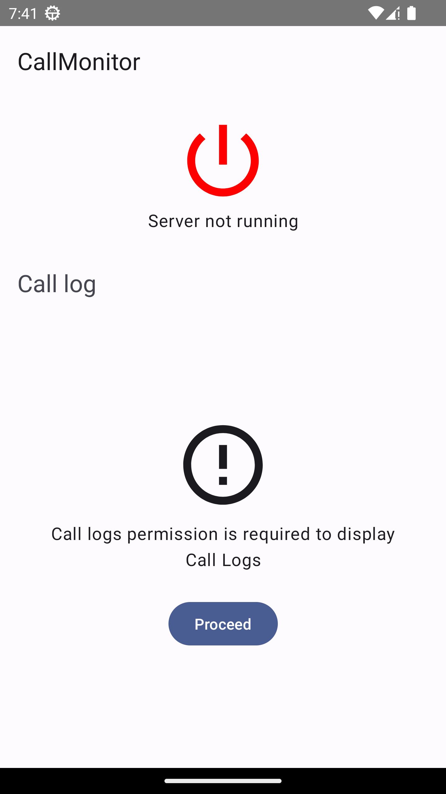

Clicking on server controls requests all the permissions that are optionally required to run the server:

&nbsp;&nbsp;&nbsp;&nbsp;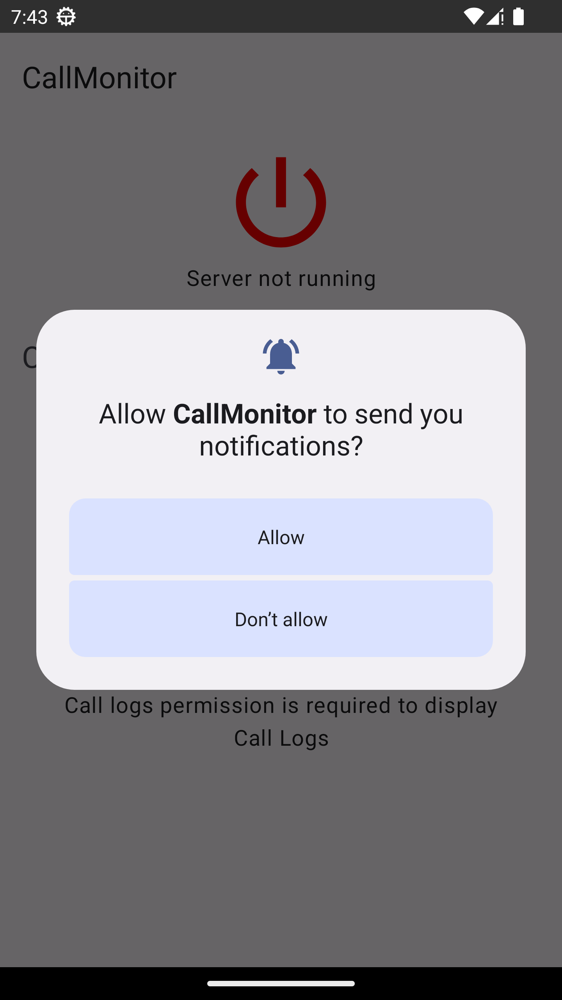
&nbsp;&nbsp;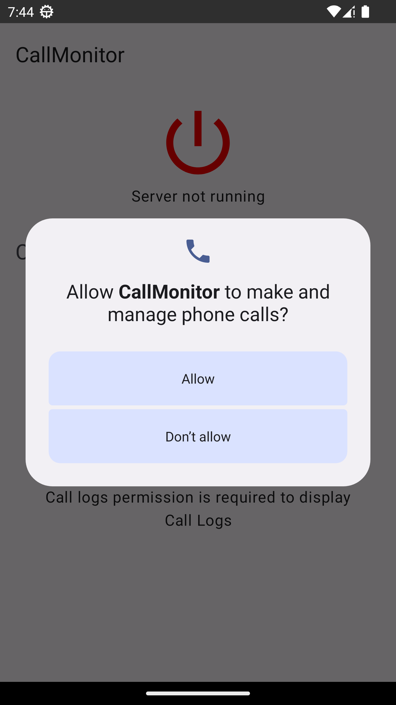

- *`POST_NOTIFICATIONS`* to show a foreground service notification and server error notifications. Denying it will run the server without notification functionality;
- *`READ_CALL_LOG`* to read call logs, same as in the main screen. Denying it will make *`/log`* respond with *`"PERMISSION_DENIED"`*;
- *`READ_CONTACTS`* to resolve contact name by the phone number. Denying it will:
- - populate *`"name"`* field in *`/log`* response with *`null`* (unless *`Calls.CACHED_NAME`* is available);
- - populate *`"name"`* field in *`/status`* response with *`null`*;
- *`READ_PHONE_STATE`* to be able to receive ongoing call state. Denying it will make *`/status`* service to respond with *`"PERMISSION_DENIED"`*;
- *`READ_PHONE_NUMBERS`* to be able to receive phone numbers for ongoing an call state. Denying it will make `/status` respond with *`null`* in *`number`* and *`name`* fields, however, it doesn't seem possible to deny it while allowing *`READ_PHONE_STATE`*, because they are merged under the "Phone" permission in the user interface;

The response jsons will contain null-value fields if the phone numbers or contact names cannot be resolved either due to lack of entry or lack of permission.

Main screen will display all server states:

&nbsp;&nbsp;&nbsp;&nbsp;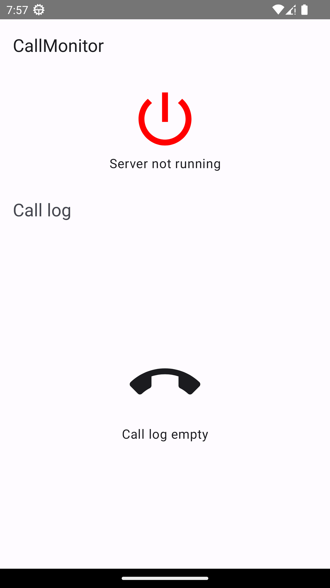
&nbsp;&nbsp;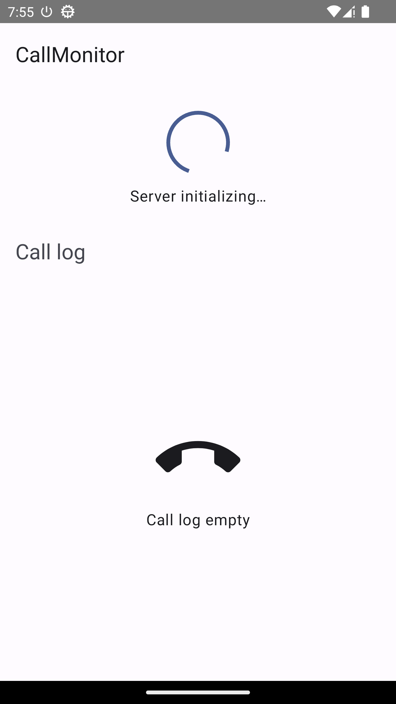
&nbsp;&nbsp;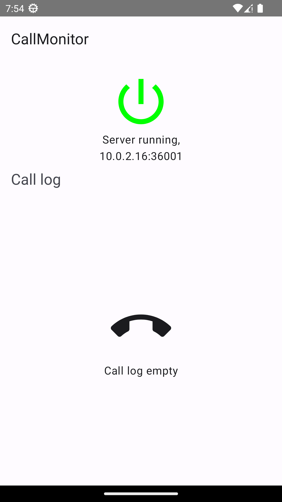
&nbsp;&nbsp;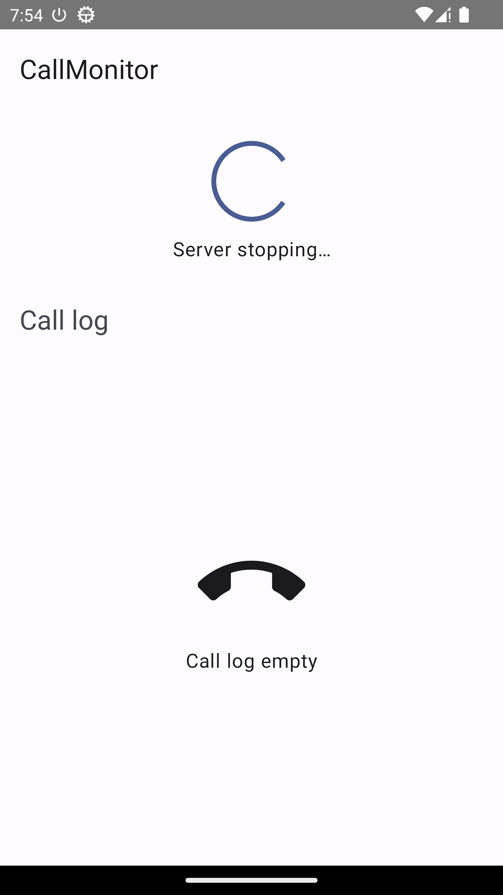
&nbsp;&nbsp;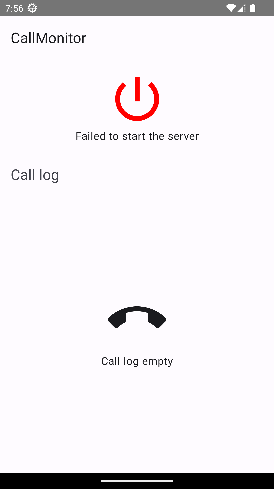

Also, a foreground service notification will be shown, if the permission allows it's visibility

&nbsp;&nbsp;&nbsp;&nbsp;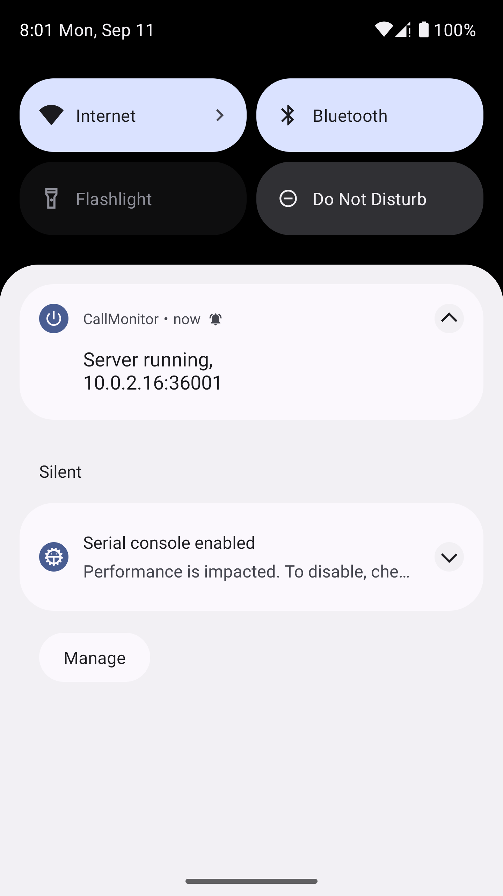
&nbsp;&nbsp;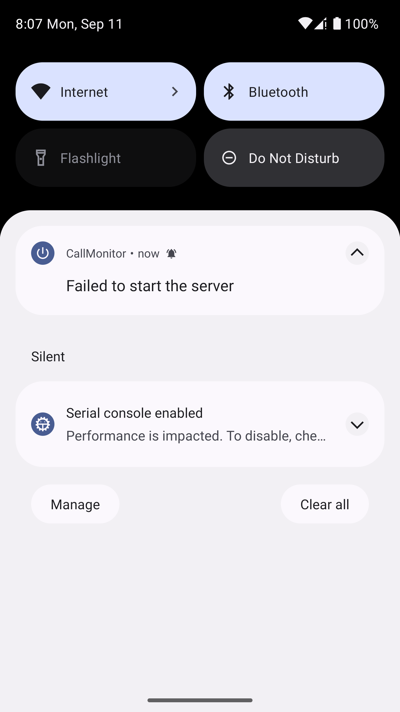

The server runs on port 36001, which is registered for AllPeers Network, which is discontinued. Meaning there's a good chance no one else will use it.

Picking an unassigned port means risking it will be assigned in future. Thus, the chosen port was registered for AllPeers Network is used, which is discontinued. Meaning there's a good chance that no one else will use it.

Source [iana.org](https://www.iana.org/assignments/service-names-port-numbers/service-names-port-numbers.xhtml?search=36001])

# Architecture

This application uses a modified variant of ["*Clean Architecture*" by Uncle Bob](https://blog.cleancoder.com/uncle-bob/2012/08/13/the-clean-architecture.html)

Please refer to the diagram below that compares it with original Clean Architecture by Uncle Bob.

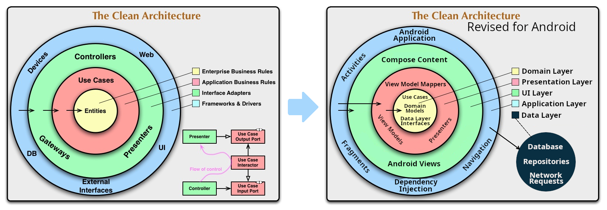

[Multi-layer architecture](https://developer.android.com/topic/architecture) is used and application layers are separated by Gradle modules. Such a separation provides the following benefits:

- strict dependency rules. *`presentation`* and *`domain`* layers do not know anything about the *`data`* layer, they do not depend on it, and as a result you can't accidentally use *`Room`*, *`DataStore`* or any other *`data`* framework in those modules;
- less dependencies per module. Individual *Gradle* modules depend on less stuff;
- implementation details in *`ui`* or *`data`* layer can be easily replaced without affecting other modules.

# Layers overview

## Domain layer

This is the core of the application itself. I.e., what the application does.

It does not know about the UI, database or networking. These details are implemented in *`data`*, *`presentation`* and *`ui`* modules.

Contains domain models, for example:

- [CallLogEntry](domain/src/main/java/com/dd/callmonitor/domain/calllog/CallLogEntry.kt)
- [CallStatus](domain/src/main/java/com/dd/callmonitor/domain/callstatus/CallStatus.kt)

Contains Use Cases that represent business logic or otherwise common actions, see:

- [ObserveCallLogUseCase](domain/src/main/java/com/dd/callmonitor/domain/calllog/ObserveCallLogUseCase.kt)
- [NormalizePhoneNumberUseCase](domain/src/main/java/com/dd/callmonitor/domain/phonenumbers/NormalizePhoneNumberUseCase.kt)

Contains interfaces to data layer, for example:

- [CallLogRepository](domain/src/main/java/com/dd/callmonitor/domain/calllog/CallLogRepository.kt)
- [CallStatusRepository](domain/src/main/java/com/dd/callmonitor/domain/callstatus/CallStatusRepository.kt)

Also, contains commong utils:

- [Either](domain/src/main/java/com/dd/callmonitor/domain/util/Either.kt)
- [Optional](domain/src/main/java/com/dd/callmonitor/domain/util/Optional.kt)

## Data layer

The server implementation and all the functionality that is needed to query and store the data is here.

In this app, only data layer has *`DataStore`* and *`Ktor`* dependency and knows about it.

It contains models that are useful for data layer only, for example:

- [CallLogResponseEntry](data/src/main/java/com/dd/callmonitor/data/server/routes/log/CallLogResponseEntry.kt) and
- [StatusResponse](data/src/main/java/com/dd/callmonitor/data/server/routes/status/StatusResponse.kt)

Contains mappers to map domain models to response models:

- [CallLogResponseMapper](data/src/main/java/com/dd/callmonitor/data/server/routes/log/CallLogResponseMapper.kt)
- [StatusResponseMapper](data/src/main/java/com/dd/callmonitor/data/server/routes/status/StatusResponseMapper.kt)

Also, contains reopsitory implementations, see:

- [CallLogRepositoryImpl](data/src/main/java/com/dd/callmonitor/data/calllog/CallLogRepositoryImpl.kt)
- [CallStatusRepositoryImpl](data/src/main/java/com/dd/callmonitor/data/callstatus/CallStatusRepositoryImpl.kt)

Because the reposities are marked with `Kotlin` `internal` keyword and DI is not present in `data` module per design, factories are used to create the repositories:

- [CallLogRepositoryFactory](data/src/main/java/com/dd/callmonitor/data/calllog/CallLogRepositoryFactory.kt)
- [CallStatusRepositoryFactory](data/src/main/java/com/dd/callmonitor/data/callstatus/CallStatusRepositoryFactory.kt)

## Presentation layer

Depends on *`domain`* layer.

Implements *MVPVM* pattern, contains Presenters, ViewModels and ViewModelUpdaters and mappers from *`domain`* models to *`view models`*.

Does not contain *Views* or *Compose* content. This is designed to make MVPVM unrelated to actual view implementation.

Does not make use of Android components like *`Activities`*, *`Fragments`*, *`Services`* or *`Dialogs`*.

**Please note that in the chart below *Fragment* belongs to *Application module*** and is illustrated for the purpose of showing the data flow.

**Please note that *Fragments* are not used in this application, in this case *Activity* is used. The image is sourced from my other project so I did not update the *Fragment* reference with *Activity* reference for this doc.**

&nbsp;&nbsp;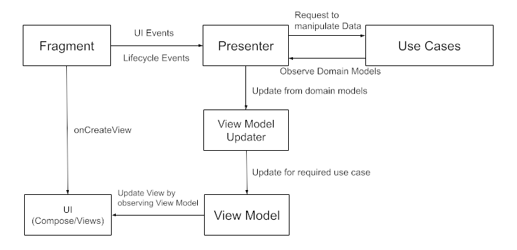

he *`Presenter`* receives *UI* and *lifecycle* events and decides how to handle the events by choosing a corresponding `UseCase`.

[CallLogPresenter](presentation/src/main/java/com/dd/callmonitor/presentation/calllog/CallLogPresenter.kt) loads groups domain models by interacting with [GetCallLogUseCase](domain/src/main/java/com/dd/callmonitor/domain/calllog/GetCallLogUseCase.kt), transforms domain models to list item view models by [CallLogEntryViewModelMapper](presentation/src/main/java/com/dd/callmonitor/presentation/calllog/CallLogEntryViewModelMapper.kt) and updates the screen view model by [CallLogViewModelUpdater](presentation/src/main/java/com/dd/callmonitor/presentation/calllog/CallLogViewModelUpdater.kt)

*ViewModelUpdater* is needed because you don't want your *`presenter`* to know how to update the view model, as if you try testing it you would have to set up loading and updating all the fields for each scanario. By extracting the knowledge necessary to update the view model you just need to test if a *ViewModelUpdater* is called.

## UI layer

Depends only on the *`presentation`* layer. Provides Views or Compose content to dispay data from *`presentation`* *`ViewModels`*.

This ensures that the *`presentation`* layer is always agnostic about the view implementation.

You can easily swap-out *`ui`* implementations from your *`app`* module. For example, you can create a *`ui`* module for the same view model but with a Data Binding framework instead of *Compose* and swap a module dependency based on your build type.

## Application layer

Here lies everything that is needed to build the *Android* Application.

It contains *Android* components like *`Application`*, *`Activity`*, *`Fragment`*, *`Service`*, etc.

It also knows how to build the DI graph and the DI framework is not leaked to any other modules, which minimizes the effort of replacing the DI framework if necessary.

# Downsides

Having Gradle modules per each layer means the application is still a monolith, and if you'd want to extract features to their own modules, you'll also have to create all the layer modules for each feature.
But splitting by features and then layers is possible with the following module structure (see [Nested Modules in Gradle](https://www.developerphil.com/nested-modules-in-gradle/))

- app
- feature-1
- - data
- - domain
- - presentation
- - ui
- feature-2
- - data
- - domain
- - presentation
- - ui

Or, if you have a centralized database

- app
- data (centralized database, application-wide network requests, etc)
- domain (repository interfaces for centralized data, centralized domain models, common use cases)
- feature-1
- - data (network requests for feature-1, DataStore for data in scope of feature-1, etc)
- - domain (use cases for feature-1)
- - presentation
- - ui
- feature-2
- - domain (use cases for feature-2)
- - presentation
- - ui

# Additional notes:

Permissions are defined in *`data`* module, as it is the one that uses them, even though is not the one requesting them, because requesting permissions are done in *`Activty`* or *Compose* content where *`accompanist-permissions`* can be used.

Due to a huge and time consuming scope of the project, not everything is unit tested, and there are no integration user story tests.

Maintaining a good git history is also very time consuming, especially in cases where you had to amend/revert the changes or when you build a feature step by step. So my history was rather chaotic and far from ideal so I did not include my repository in the archive.

You may find some rare edge case missing or topics that might pose questions, these are marked in source files by comments starting with "Note for reviewers". Those usually wouldn't be added in production code. Comments or docs that are not starting with "Note for reviewers" are those that would be in production code.